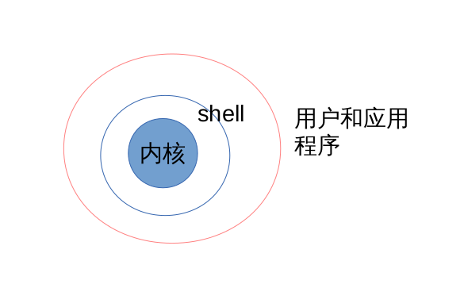
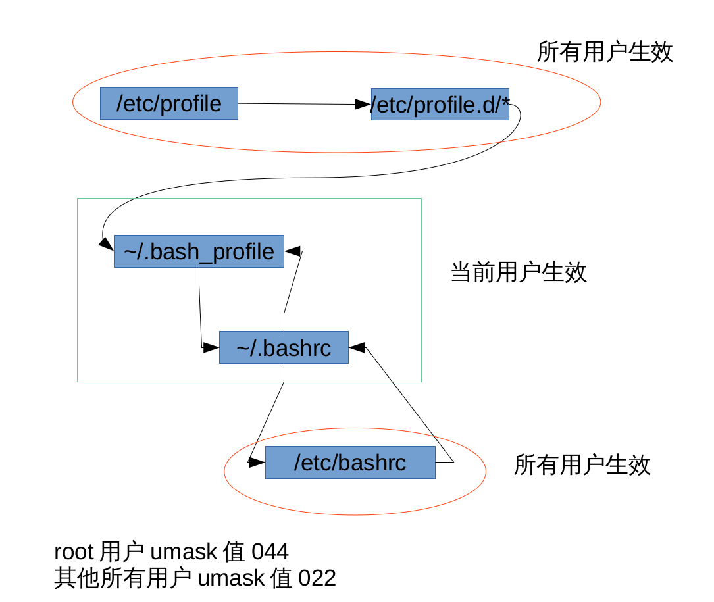
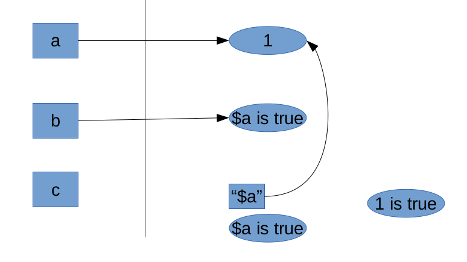

# Shell Scripts

[TOC]

---
## 教学环境介绍

* client rhel7.2 172.25.0.10
* server rhel7.2 172.25.0.11

如果真的想走IT这条路，想真正管理好你的主机，那么学习自动化管理工具Shell Scripts 非常重要！

就是将一些命令放在一起去执行，并且不需要编译就能执行，很方便，所以在日常工作中可以用shell scripts来简化我们的管理。可以但到我们linux中，很多服务的启动都是透过shell脚本来启动的。

如果你不会脚本，那么服务器出问题的时候，真的会求助无门，所以好好地学习吧！

## shell 简介

###  什么是 shell

Shell 是一个命令解释器 , 是人与操作系统之间的桥梁。



我们平时无论任何操作 , 最终都要操作硬件 , 比如输入一个字符 “ a ”, 那么信号 首先会从键盘传递到主板 , 通过主板总线传递到内存 ,CPU, 显卡等 , 最终经过显卡的运 算完成后在屏幕的某个位置 , 显示一个特定字体的字符 “a ”, 这一整个过程可以说是 不断的和硬件打交道了 , 但是如果让人去发送这些硬件操作码显然不适合 , 因为这不是人干 的事 , 所以我们有了操作系统 , 操作系统通过加载一定的硬件驱动 , 从而控制硬件 , 操作硬 件 , 那剩下的事就是如何和操作系统通信了 , 对于普通的系统管理员来说 , 这也是一件非常 困难的事 , 为了方便人和操作系统沟通 , 我们开发了 shell 。

Shell 可以将我们平时运行的一些指令解释给操作系统执行 , 方便管理员操作系统。 而 Shell 的脚本其实是一种命令的堆积 , 我们将所有需要执行的命令 , 以从上至下的方 式写在一个文件当中 , 交给 shell 去自动解释执行。

### shell 历史

在 AT&T 的 Dennis Ritchie 和 Ken Thompson 设计 UNIXTM 的时候 , 他们想要为 用户创建一种与他们的新系统交流的方法。 那时的操作系统带有命令解释器。命令解释器接受用户的命令 , 然后解释它们 , 因而计 算机可以使用这些命令。

但是 Ritchie 和 Thompson 想要的不只是这些功能 , 他们想提供比当时的命令解释器 具备更优异功能的工具。这导致了 Bourne shell( 通称为 sh) 的开发 , 由 S.R. Bourne 创 建。自从 Bourne shell 的创建 , 其它 shell 也被一一开发 , 如 C shell(csh) 和 Korn shell(ksh) 。

当自由软件基金会想寻求一种免费的 shell, 开发者们开始致力于 Bourne shell 以及当 时其它 shell 中某些很受欢迎的功能背后的语言。

这个开发结果是 Bourne Again Shell, 或称 bash 。虽然你的 Red Hat Linux 包括几 种不同的 shell,bash 是为互动用户提供的默认 shell 。

### 常见的 shell

* Bourne shell 即 sh:AT&T 贝尔实验室编写的一个交换式的命令解释器。
* C Shell :Bill Joy 于 20 世纪 80 年代早期开发。为了让用户更容易的使用 , 他把语法 结构变成了 C 语言风格。它新增了命令历史、别名、文件名替换、作业控制等功能。
* korn shell (ksh) 是一个 Unix shell 。它由贝尔实验室的 David Korn 在二十世纪八十 年代早期编写。它完全向上兼容 Bourne shell 并包含了 C shell 的很多特性。
* Bourne-Again Shell: bash 是一个为 GNU 项目编写的 Unix shell 。它的名字是一 系列缩写 :Bourne-Again SHell — 这是关于 Bourne shell(sh) 的一个双关语 (Bourne again / born again) 。 Bourne shell 是一个早期的重要 shell, 由 Stephen Bourne 在 1978 年前后编写 , 并同 Version 7 Unix 一起发布。 bash 则在1987 年由 Brian Fox 创造。 在 1990 年 ,Chet Ramey 成为了主要的维护者。 bash 是大多数 Linux 系统以及 Mac OS X v10.4 默认的 shell, 它能运行于大多数 Unix 风格的操作系统之上 , 甚至被移植到了 MicrosoftWindows 上的 Cygwin 和 MSYS 系统中 , 以实现 windows 的 POSIX 虚拟接口。此外 , 它也被 DJGPP 项目移植到了 MS- DOS 上。
* POSIX shell :POSIX shell 与 Korn shell 非常的相似 , 当前提供 POSIX shell 的最 大卖主是 Hewlett-Packard 。

### 为什么 Shell

* 解决重复操作的作业。
* 节约时间 , 提高工作效率。
* 功能强大 , 使用简单。


```bash
# 1.查看系统当中合法的shell
cat /etc/shells


    # /etc/shells: valid login shells
    /bin/sh
    /bin/dash
    /bin/bash
    /bin/rbash
```


```bash
# 2.修改用户登录时使用的shell程序
useradd batman
chsh -s /bin/sh batman
grep batman /etc/passwd
```

    useradd: Permission denied.
    useradd: cannot lock /etc/passwd; try again later.
    chsh: user 'batman' does not exist


```bash
# 3.用户的登录流程



## 对于所有的用户HISTSIZE 500 ，对于root用户HISTSIZE 1000
/etc/profile start
/etc/profile end

~/.bash_profile start
~/.bashrc start
/etc/bashrc start

/etc/bashrc end
~/.bashrc end
~/.bash_profile end
```

## shell的变量功能

### 什么是变量

* 让一个特定的字符代表不固定的内容，有点像y=ax+b,y就是变量，
* 用简单的字眼来代替比较复杂或者容易变动的数据，好处就是方便！

比如系统中的MAIL和USER变量，根据当前登陆的用户而变化

* 对脚本的用处——例如ule考试的评分脚本，根据你们的机器号的不同，去检测不同的学生考试成绩

### 变量的设置、查看和取消 echo unset


```shell
        查看	echo ${MAIL}
			echo $MAIL
		设置	变量名=变量的内容
				myname=booboo
				myname="booboo wei"
			注意事项
				变量命名规则：
					1.由数字，字母，下划线_组成
					2.不能以数字开头
					3.字母区分大小写，大小写敏感
				变量内容若有空格，可以使用单引号或者双引号
					双引号保留特殊字符原有属性
					单引号特殊字符变一般字符（纯文本）
					也可使用\跳脱字符将特殊字符变成一般字符
				`指令`或$(指令)可以将指令的结果变成变量内容
		取消	unset 变量名
				unset myname
```                

#### 课堂练习
			1. 设置变量myname=superman并查看变量的值；
			2. 设置变量myname1=I am superman
				myname2="I am superman"
				myname3='I am superman'并查看所有变量的值；
			3. 设置两个变量分别为name1="$myname is myname"和name2='$myname is myname';并查看变量的值；
			4. 设置变量kernel的值为当前系统的内核版本号；
			5. 设置变量num的值为/etc/目录下所有以.conf结尾的文件的总数；
			6. 取消练习中的有所变量。




### 变量内容的删除和替换

```shell
		变量设定方式		说明
		${变量#关键词}		若变量内容从头开始的数据符合『关键词』,则将符合的最短数据删除
		${变量##关键词} 		若变量内容从头开始的数据符合『关键词』,则将符合的最长数据删除
		${变量%关键词} 		若变量内容从尾向前的数据符合『关键词』,则将符合的最短数据删除
		${变量%%关键词}		若变量内容从尾向前的数据符合『关键词』,则将符合的最长数据删除
		${变量/旧字符串/新字符串} 	若变量内容符合『旧字符串』则『第一个旧字符串会被新字符串替换』
		${变量//旧字符串/新字符串}	若变量内容符合『旧字符串』则『全部的旧字符串会被新字符串替换』
```


#### 课堂练习

1. 设置变量path=${PATH} 并查看；
2. 设置变量path=/batman/bin:${path}:/superman/bin 并查看；
3. 读取变量的时候将/batman/bin:及第一个冒号及之前的删除；
4. 读取变量的时候将最后一个冒号及之前的都删除；
5. 读取变量的时候将:/superman/bin及最后一个冒号及之后的删除；
6. 读取变量的时候将第一个冒号及之后的都删除；
7. 读取变量的时候将第一个sbin替换成SBIN；
8. 读取变量的时候将所有的sbin替换成SBIN；
9. 取消练习中的path变量。


### 变量的分类：局部变量和全局变量 env set export

*           分类标准	变量是否会被子程序所继续引用；局部变量不会；全局变量会
*			env 	列出目前shell环境下的所有全局变量
*			set 	查看所有变量，包括环境变量和局部变量
*			export	将局部变量转成全局变量	export myname

#### 课堂练习

			1. 打开一个终端bash，查看该终端的pid号；
			2. 设置本地变量justice1="this is local"并查看;
			3. 设置环境变量justice2="this is env"并查看;
			4. 打开子终端bash，查看该终端的pid号和ppid号；
			5. 在子终端中分别查看变量justice1和justice2的值；


### 变量读取、数组与宣告 read array declare

```shell
		read	从键盘读取数据存入变量
			read -p "plz input yourname:" -t 30 name 按下回车输入变量name的值，会等待30s结束
		array
			数组的设定	A[0]=1;A[1]=2;A[2]=3
					A=(1 2 3)
					A=(1 2 3 [50]=4)
					A=(1 2 3 [50]=4 5)
			数组的读取	echo ${A[0]}
					echo ${A[@]}
					echo ${A[*]}
					* 代表的是一次取出所有的值 ,@ 代表依次取值
						for i in "$A[@]";do echo $i;done
						for i in "$A[*]";do echo $i;done
		declare
			declare 参数
				-a 将变量看成数组
				-i 将变量看成整数
				-r 使变量只读
			x=1
			y=2
			sum=$(($x+$y))
```

#### 课堂练习

			1. 用read命令从键盘读取num变量的值，提示语句为“请输入你的机器号：”，限时间20s；
			2. 设置数组S 第一位为1，第二位为2，第三十位为4，第三十一位为5，读取数组所有的值，读取数组第二位；
			3. 设置变量x=1，y=2，变量sum=$x+$y，查看sum的值；
			4. 宣告变量x为整数型值为1，变量y为整数型值为2,变量sum为整数型=$x+$y，查看sum的值；

## 数据流重导向redirection


### 何谓数据流重导向

```shell
		指令执行后的结果有：
            exit    命令执行是否正确的返回值?	0正确；！0错误		简称	代码	符号
            return	命令执行输出的正确信息	standard output		    stdout	1	>或者>>
					命令执行输出的错误信息	standard error output	stderr	2	2>或者2>>
		指令执行前的输入：		命令执行输入的信息		standard in		stdin	0	<或者<<

		用法总结			
			1> :以覆盖的方法将『正确的数据』输出到指定的文件中；
			1>>:以追加的方法将『正确的数据』输出到指定的文件中；
			2> :以覆盖的方法将『错误的数据』输出到指定的文件中；
			2>>:以追加的方法将『错误的数据』输出到指定的文件中；

		cat	从键盘读取数据存入文件
			cat > /tmp/catfile 以ctrl+d结束
			cat > /tmp/catfile < /tmp/passwd
			cat > /tmp/catfile << ENDF
			standard in
			ENDF===>结束提示符
```

#### 课堂练习

			1. 查看系统/目录下的所有文件名和属性，并记录到/tmp/file文件中；
			2. 查看系统/var/目录下的所有文件名和属性，并追加记录到/tmp/file文件中；
			3. 切换到student用户，在/home目录下查找文件名为.bashrc的文件是否存在；
			4. 切换到student用户，在/home目录下查找文件名为.bashrc的文件，将该命令执行输出的正确信息显示到屏幕上，将该命令执行输出的错误信息放到黑洞/dev/null中；
			5. 切换到student用户，在/home目录下查找文件名为.bashrc的文件，将该命令执行输出的正确信息保存到/tmp/stdout文件中并查看，将该命令执行输出的错误信息放到黑洞/dev/null中；
			6. 切换到student用户，在/home目录下查找文件名为.bashrc的文件，将该命令执行输出的正确信息保存到/tmp/stdout文件中，将该命令执行输出的错误信息保存到/tmp/stderr文件中，并查看；
			7. 切换到student用户，在/home目录下查找文件名为.bashrc的文件，将该命令执行输出的所有信息（正确和错误）都保存到/tmp/all中，并查看；
			8. 使用cat命令从键盘读取数据helloword并覆盖/tmp/catfile文件；
			9. 使用cat命令将/etc/passwd/的内容覆盖/tmp/catfile文件；
			10. 使用cat命令从键盘读取数据helloword并覆盖/tmp/catfile文件，以结束提示符的方式结束；

### 命令执行的判断依据 ; && ||

*		CMD1 && CMD2 	如果前一个命令 (CMD1) 能够正确被执行 , 则执行后一个命令 (CMD2)
*		CMD1 || CMD2 	如果前一个命令 (CMD1) 被正确执行 , 则不执行后一个命令 (CMD2), 如果前一个命令(CMD1) 执行错误 , 则执行后一个命令 (CMD2).
*		CMD1 ; CMD2	命令之间没有关系，从第一个开始执行，不管是否正确执行都会去执行第二个命令


#### 课堂实验

			1. 创建目录/tmp/cmd,如果创建成功那么就再创建一个目录/tmp/cmd/cdm1;
			2. 创建目录/tmp/cmd,如果创建失败，那么就再船舰一个目录/tmp/cmd/cmd2;
			3. 不管目录/tmp/cmd是否创建成功，都会去再创建一个目录/tmp/tmpcmd;


### 管道命令pipe

```shell
    #截取 grep cut
		grep bash$ /etc/passwd
		cut -d : -f 3 /etc/passwd
	#排序 sort uniq
		sort -t: -k3 -n /etc/passwd
	#统计 wc
		wc -l /etc/passwd
	#替换 xargs
		find /sbin/ -perm +7000|wc -l
		find /sbin/ -perm +7000|xargs wc -l

		课堂练习：
		1.找出/sbin/目录下有特殊权限的文件，并统计每个文件的行数
		2.找出/sbin/目录下有特殊权限的文件，并统计有几个

	#减号 -
		课堂练习：
		1.将/home目录打包压缩后解压到/tmp目录
```


### shell下的特殊符号
	#	注释符
	\	跳脱符
	|	管道
	;	连续指令的下达
	~	家目录
	$	取用变量符
	&	进程控制后台运行
	!	逻辑运算非
	/	根目录
	>,>>	数据流重导向 输出
	<,<<	数据流重导向 输入
	''	特殊字符失效
	""	特殊字符有效
	``	命令执行的结果
	{}	命令的组合
